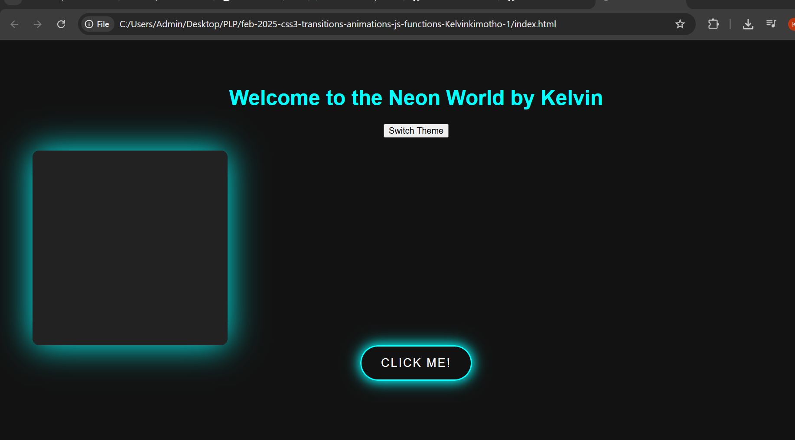

# CSS3 Transitions, Animations, and Advanced JavaScript Functions

## Objectives
- Create smooth CSS transitions and animations.  
- Use JavaScript functions for dynamic behavior.  
- Implement local storage for data persistence.  
- Allow theme switching between Light and Dark modes with persistence.

## Solution Overview

✅ Built a **neon-themed page** with buttons and animated elements.  
✅ Implemented a **theme switcher** (Light Mode / Dark Mode) using JavaScript and `localStorage` to remember the user's preference.  
✅ Added a **"pulse" animation** to a neon box, triggered dynamically when clicking a button.

### Main Features
- **Theme Switching**  
  Users can toggle between light and dark themes. The selected theme is saved using `localStorage`, so the preference persists even after page reloads.

- **Dynamic Animation**  
  Clicking the "Click Me!" button toggles a **pulsing neon animation** on a square element.

- **Local Storage**  
  User's selected theme preference is saved in their browser locally.

- **Clean UI and Responsive Design**  
  Neon effects with smooth transitions for a visually striking appearance.

---

## Instructions
- Add CSS animations to elements like buttons or divs.
- Write JavaScript functions that:
  - Store and retrieve user preferences using `localStorage`.
  - Trigger animations based on user actions (button click).
  - Toggle and persist themes across page reloads.

---

## Tasks Completed
- [x] Create a CSS animation (pulse effect on a neon box).
- [x] Store the user's selected theme in `localStorage`.
- [x] Build a dynamic theme switcher button (Light/Dark mode).
- [x] Trigger animations using JavaScript events.
- [x] Update elements' styles dynamically using JavaScript.
- [x] Add a clean UI with neon color effects.

---

## Preview

_A screenshot showing the animation and theme switcher will be added here._

> **Example:**  
> 

---

## Technologies Used
- **HTML5**
- **CSS3** (Animations, Transitions)
- **JavaScript** (DOM manipulation, `localStorage`)

---

## Happy Coding! 💻✨
